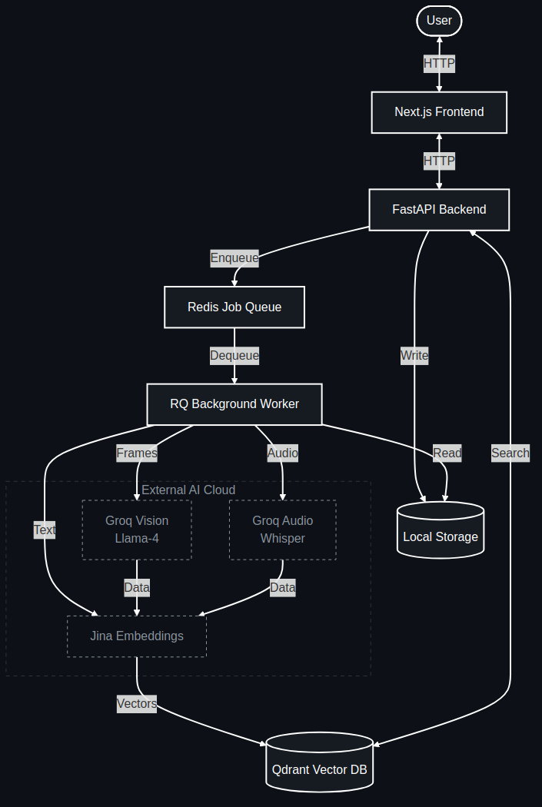

# VideoSearch AI

> **A Production-Grade Multi-Modal Video Search System**
>
> built with **FastAPI**, **Next.js**, **Qdrant**, and **Groq AI**.


## Overview

This project is a **semantic search engine for videos**. Unlike traditional keyword search which relies on metadata (titles/tags), this system "watches" and "listens" to the video content itself.

It uses **AI Vision** to understand visual scenes and **AI Speech-to-Text** to understand spoken words. These are converted into distinct vector embeddings and stored in a vector database (`Qdrant`), enabling users to search for specific moments in a video using natural language (e.g., *"Find the part where they discuss revenue"* or *"Show me the drone shot of the forest"*).

---

## Architecture

The system follows an **event-driven microservices** architecture to handle heavy video processing tasks asynchronously.



---

## Tech Stack

### **Backend & Infrastructure**
| Component | Technology | Role |
|-----------|------------|------|
| **Core Framework** | **FastAPI** (Python 3.11) | High-performance async REST API |
| **Vector Database** | **Qdrant** | Stores & queries 1024-dim embeddings |
| **Job Queue** | **Redis** + **RQ** | Manages async video processing jobs |
| **Video Processing** | **FFmpeg** | Extracts frames and audio tracks |
| **Containerization** | **Docker Compose** | Orchestrates Qdrant and Redis services |

### **AI Cloud Stack (Free Tier)**
| Modality | Provider | Model |
|----------|----------|-------|
| **Vision** | **Groq** | `meta-llama/llama-4-scout-17b-16e-instruct` |
| **Audio** | **Groq** | `whisper-large-v3` |
| **Embeddings** | **Jina AI** | `jina-embeddings-v3` (1024 dimensions) |

### **Frontend**
| Component | Technology | Role |
|-----------|------------|------|
| **Framework** | **Next.js 14** | React framework for UI |
| **Styling** | **Tailwind CSS** | Modern, responsive styling |
| **Language** | **TypeScript** | Type-safe development |

---

## How It Works (The Pipeline)

### 1. Ingestion (`/upload`)
- User uploads a video via the Frontend.
- Backend saves the file locally and creates a **Processing Job** in Redis.
- Returns a `job_id` to the client for polling status.

### 2. Processing (Background Worker)
The `RQ Worker` picks up the job and executes the pipeline:
1.  **Frame Extraction:** Uses FFmpeg to extract 1 frame per second.
2.  **Vision Analysis:** Sends frames to **Groq (Llama 4)** to generate detailed textual descriptions of the scene.
3.  **Audio Transcription:** Extracts audio and sends to **Groq (Whisper)** to get timestamped transcripts.
4.  **Embedding Generation:** Converts both Vision descriptions and Audio transcripts into vector embeddings using **Jina AI**.
5.  **Indexing:** Stores these vectors (with metadata like timestamps and thumbnails) in **Qdrant**.

### 3. Search (`/search`)
- User queries: *"black ring in finger"*
- Backend converts query to vector using **Jina AI**.
- Performs **Cosine Similarity Search** in Qdrant.
- Returns timestamps where the semantic similarity score > `0.15`.

---

## Setup & Installation

### Prerequisites
- Docker & Docker Compose
- Python 3.10+
- Node.js 18+
- FFmpeg (`sudo apt install ffmpeg`)

### 1. Start Infrastructure
Start Qdrant and Redis containers:
```bash
cd backend
docker-compose up -d
```

### 2. Backend Setup
```bash
cd backend
python -m venv venv
source venv/bin/activate
pip install -r requirements.txt

# Configure Environment
cp .env.example .env
# Edit .env and add your API credentials:
# - GROQ_API_KEY
# - JINA_API_KEY
```

**Start the Worker:**
```bash
# Terminal 1
rq worker --url redis://localhost:6380 default
```

**Start the API:**
```bash
# Terminal 2
uvicorn src.main:app --reload
```

### 3. Frontend Setup
```bash
cd frontend
npm install
npm run dev
```

Visit **http://localhost:3001** to use the application!

---

## API Documentation

Swagger UI is available at **http://localhost:8000/docs**

### Key Endpoints
- `POST /upload`: Upload a video file
- `GET /status/{job_id}`: Check processing progress
- `POST /search`: Semantic search
- `GET /video/{video_id}`: Stream video content

---

## Contributing
1. Fork the repo
2. Create your feature branch (`git checkout -b feature/amazing-feature`)
3. Commit your changes (`git commit -m 'Add amazing feature'`)
4. Push to the branch (`git push origin feature/amazing-feature`)
5. Open a Pull Request

---

## License
Distributed under the MIT License. See `LICENSE` for more information.
